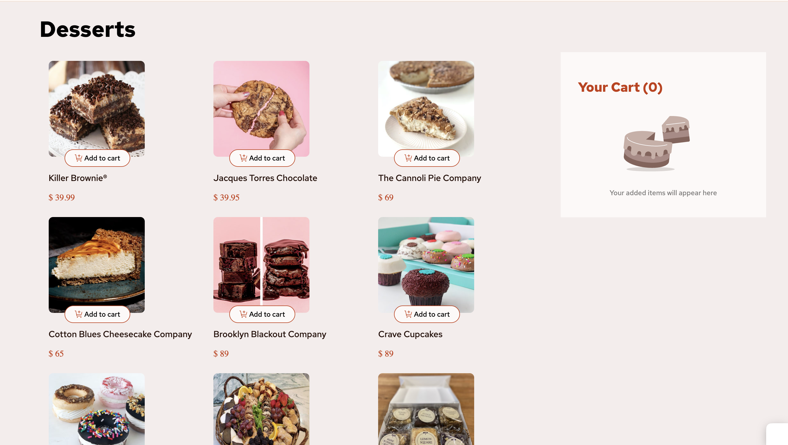
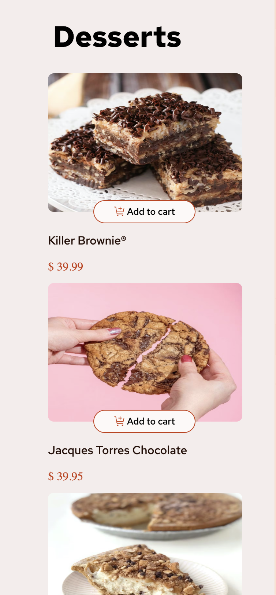

# 🍨 Dessert Shop – Product List with Cart

A responsive **dessert ordering web app** built with **HTML, CSS, and JavaScript** that fetches real-time data from an API and allows users to add items to a cart, update quantities, and confirm orders with a clean and interactive UI.

---

## ✅ Features

- **Dynamic Product Listing**: Fetches dessert items from an external API.
- **Add to Cart Functionality**: Users can add products to the cart with one click.
- **Quantity Management**: Increment and decrement product quantities directly from the cart and product card.
- **Order Summary**:
  - Displays **cart total items**.
  - Updates **order total amount** in real-time.
- **Empty Cart State**: Shows a placeholder image and message when the cart is empty.
- **Quote Section**: Displays a **carbon-neutral delivery** message when items are added.
- **Order Confirmation Modal**:
  - Displays a **summary of ordered items** with quantity and price.
  - Shows **total order amount**.
  - Option to **start a new order** without refreshing the page.
- **Responsive Design**: Optimized for **desktop and mobile devices**.
- **Clean UI/UX**: Styled using CSS with a modern look and smooth user interactions.

---

## 🖼️ Screenshots

| Desktop View | Mobile View |
|-------------|-------------|
|  |  |

---

## 🛠️ Tech Stack

- **HTML5**
- **CSS3** (Responsive Design, Flexbox)
- **JavaScript (ES6)** for functionality
- **Axios** for API requests
- **Google Fonts**: [Red Hat Text](https://fonts.google.com/specimen/Red+Hat+Text)

---

## 📂 Project Structure

```
├── index.html        # Main HTML file
├── style.css         # Styling (Responsive + Desktop + Mobile)
├── app.js            # JavaScript functionality
├── images/           # Icons and UI images
└── README.md         # Project documentation
```

---

## ⚙️ How It Works

1. **Fetch Data**  
   - Uses **Axios** to fetch dessert items from:
     ```
     https://free-food-menus-api-two.vercel.app/desserts
     ```

2. **Render Products**  
   - Dynamically creates product cards with **image, name, and price**.

3. **Cart Management**  
   - Add items to cart  
   - Increase or decrease item quantity  
   - Remove item from cart  

4. **Order Confirmation**  
   - Displays **modal** with all items, quantities, prices, and total.

---

## 🚀 Getting Started

### 1. Clone the Repository
```bash
git clone https://github.com/yourusername/dessert-shop.git
cd dessert-shop
```

### 2. Open in Browser
Just open `index.html` in any modern browser.

---

## 📌 Future Enhancements

- ✅ Add **search and filter** functionality.
- ✅ Add **local storage** to persist cart data.
- ✅ Implement **real checkout process**.
- ✅ Add **dark mode** toggle.

---

## 🎨 UI Highlights

- Minimal and clean design.
- Responsive modal for order confirmation.
- Smooth cart updates without page reload.

---


## 👩‍💻 Author
**Prachi Garg**  
💼 [GitHub](https://github.com/prachi757) • 📧 *gargprachi678@gmail.com*  

